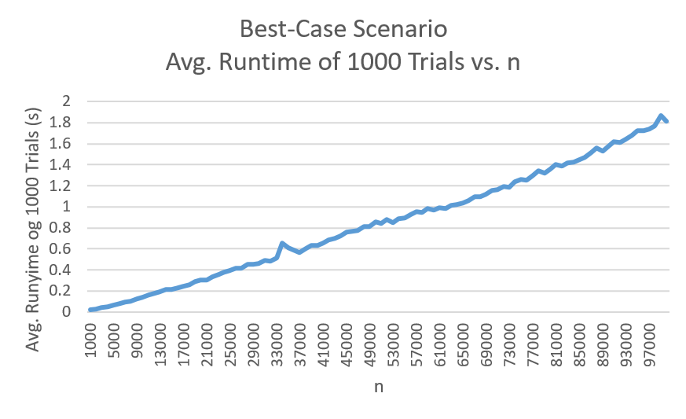
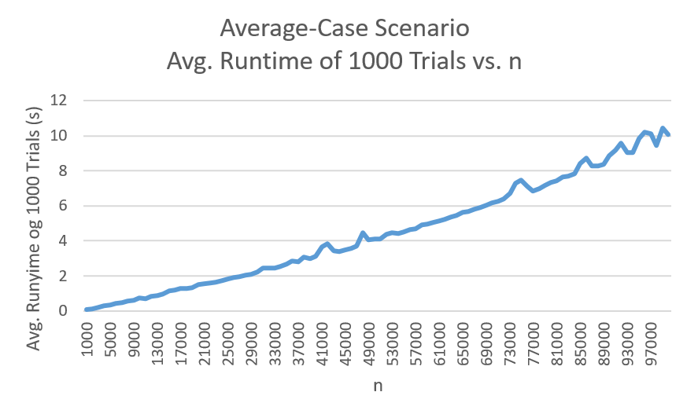
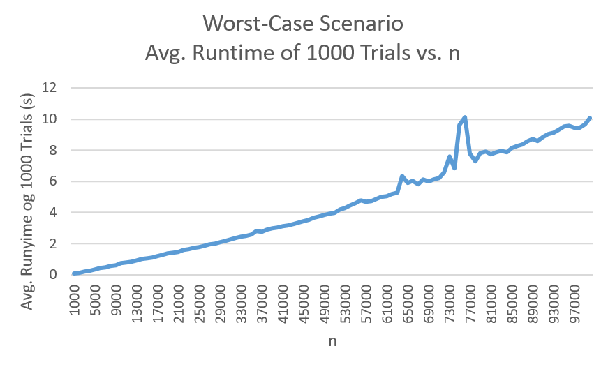

# pomegranate
Team pomegranate -- Angela Tom, Tabassum Fabiha, Shayan Chowdhury, Nadine Jackson

APCS2 pd2

L01 -- What Does the Data Say?

2018-03-14

# Hypothesis
The best case for quicksort is when the array is already in order. The runtime is O(nlogn).
The worst case for quicksort is when all elements are the same; it has a runtime of O(n^2).
A normal case is randomized numbers and the runtime is O(nlogn);

# Background
Summary of QuickSort algorithm:
QSort(arr) calls QSortH method to sort the array. QSortH(arr, left, right):
1. If @param left is equal to @param right, then the range is 0 and you don't do anything. Else, @param left should be less than @param right and you continue.
2. Perform partition within the given range at pivot point equal to the median of the range. The return value is now stored.
3. Call QSortH to sort everything from @param left to one less than the stored number and everything from one more than the stored number to @param right.

# Methodology
We tested the runtime of our quicksort algorithm by testing different sizes of arrays ranging from 1000 to 100,000, adding 1000 array sizes at a time.
For each size, we ran 1000 trials and divided the overall time by 1000 to get an average runtime for the certain array size.
In our experiment, we ran the worst case tests, best case tests, and then normal tests respectively.
Data is sent into a csv file.

# Results

# Conclusions
According to our graphs, the data seems to be relatively linear, which directly contradicts our hypothesis. However, this study still has some worth as to provide some insight into what may have caused the errors in our data. One of such could be computational errors, possibly due to problems in memory allocation. To overcome one of the issues that constantly plagued us, the infamous Stack Overflow error that may arise when dealing with large recursive calls, we increased the stack size (the memory used by Java application for garbage collection and whatnot) to about 1024 megabytes (honestly, a bit overkill) from it's default 512 kilobytes. The issues in our data may be attributed to us utilizing this newfound knowledge but not necessarily understanding it completely (I smell a QAF post...). Finally, the issues in our data could have been caused by a flaw in our own implementation of QuickSort, which could be a learning experience for not only us, but the class as a whole in how to prevent such blunders in the future. 
